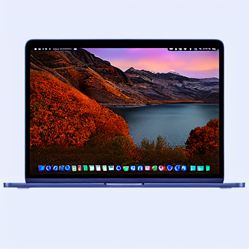

# Brand Style LoRA Training Pipeline

A complete, reproducible pipeline for training Stable Diffusion LoRA models on brand visual identity, built and tested on consumer hardware with no cloud dependency.

## What This Is

This repo documents an end-to-end workflow for fine-tuning a Stable Diffusion 1.5 model to learn and reproduce a specific brand's visual aesthetic using LoRA (Low-Rank Adaptation). The pipeline covers everything from dataset curation through training to inference evaluation.

**Documented example:** Apple product photography style: studio lighting, aluminum materials, minimalist compositions.

**Designed for:** Brand teams, creative technologists, and AI practitioners who want to generate on-brand visual assets without per-image prompting.

---

## Results

Trained on 39 images, ~10 minutes on an RTX 2080 Super. Output below generated with the trigger word `appleshot` and a single prompt: no img2img, no inpainting.



*Generated: "2026 MacBook, pure white background, three quarter view open, extremely thin bezels, soft studio lighting, modern aluminum unibody, product photography, minimalist"*

---

## Hardware Requirements

| Component | Minimum | Used in This Project |
|---|---|---|
| GPU | 8GB VRAM | NVIDIA RTX 2080 Super (8GB) |
| RAM | 16GB | 32GB |
| Storage | 50GB free | 742GB available |
| OS | Linux (Ubuntu 22.04+) | Ubuntu 24 |

Training on 8GB VRAM is achievable with the right settings. See [Hardware Requirements](docs/01-hardware-requirements.md) for the full breakdown.

---

## Pipeline Overview

```
Raw Images → Dataset Prep → Captioning → Training → Checkpoint Eval → Inference
```

1. **[Hardware Requirements](docs/01-hardware-requirements.md)** — VRAM constraints, driver setup, GPU passthrough
2. **[kohya_ss Setup](docs/02-kohya-setup.md)** — Local installation on Linux via uv, config.toml setup
3. **[Dataset Preparation](docs/03-dataset-preparation.md)** — Image selection criteria, 512x512 padding, file naming
4. **[Captioning Strategy](docs/04-captioning-strategy.md)** — Trigger words, caption formula, brand-specific considerations
5. **[Training Configuration](docs/05-training-config.md)** — All parameters explained for 8GB VRAM
6. **[Inference & Evaluation](docs/06-inference-and-evaluation.md)** — ComfyUI workflow, checkpoint testing, prompt engineering

---

## Quick Start

```bash
# 1. Clone the repo
git clone https://github.com/jasondukes/brand-lora-pipeline.git
cd brand-lora-pipeline

# 2. Set up your dataset folder
mkdir -p ~/kohya_data/datasets/your_brand/20_yourtrigger
# Drop your 512x512 training images here

# 3. Pad your images to 512x512
./scripts/pad_images.sh ~/kohya_data/datasets/your_brand/20_yourtrigger

# 4. Generate base captions
./scripts/generate_captions.sh ~/kohya_data/datasets/your_brand/20_yourtrigger yourtrigger
# Then manually review and refine each .txt file

# 5. Download SD1.5 base model
mkdir -p ~/kohya_data/models/base
wget -O ~/kohya_data/models/base/v1-5-pruned-emaonly.safetensors \
  "https://huggingface.co/Comfy-Org/stable-diffusion-v1-5-archive/resolve/main/v1-5-pruned-emaonly-fp16.safetensors"

# 6. Install kohya_ss
git clone https://github.com/bmaltais/kohya_ss.git ~/kohya_ss
cd ~/kohya_ss && git checkout v25.2.1
cp "config example.toml" config.toml
# Edit config.toml with your paths (see docs/02-kohya-setup.md)
./gui-uv.sh --listen 0.0.0.0 --server_port 7860
```

---

## Key Findings

**On dataset quality:**
Images with partial crops, accessory-only shots, or multi-product compositions hurt more than help. 39 well-selected images outperforms 100 mediocre ones.

**On base model priors:**
SD1.5 contains strong priors for well-known brands. At low LoRA strength (≤0.75), the base model's training data partially overrides your LoRA. Increase strength to 0.85–0.9 and use temporally-anchored prompt tokens (e.g. "2026 MacBook") to push past historical priors.

**On rank selection:**
Rank 8 produces recognizable style transfer but lacks capacity to fully override base model priors for well-known brands. Rank 32 is recommended for production-quality output. See [Training Configuration](docs/05-training-config.md).

**On checkpoint evaluation:**
The final checkpoint is rarely the best. Save every N steps and evaluate each one — earlier checkpoints often produce more flexible, less overfit results.

---

## Repo Structure

```
brand-lora-pipeline/
├── README.md
├── docs/
│   ├── 01-hardware-requirements.md
│   ├── 02-kohya-setup.md
│   ├── 03-dataset-preparation.md
│   ├── 04-captioning-strategy.md
│   ├── 05-training-config.md
│   └── 06-inference-and-evaluation.md
├── scripts/
│   ├── pad_images.sh
│   ├── generate_captions.sh
│   └── caption_template.txt
├── config/
│   └── kohya_config.toml
├── comfyui/
│   └── lora_test_workflow.json
└── outputs/
    └── samples/
```

---

## License

MIT — use freely, adapt for your own brand pipelines.

---

## Acknowledgements

Built with [kohya_ss](https://github.com/bmaltais/kohya_ss) by bmaltais, [ComfyUI](https://github.com/comfyanonymous/ComfyUI), and Stable Diffusion 1.5 by RunwayML.
